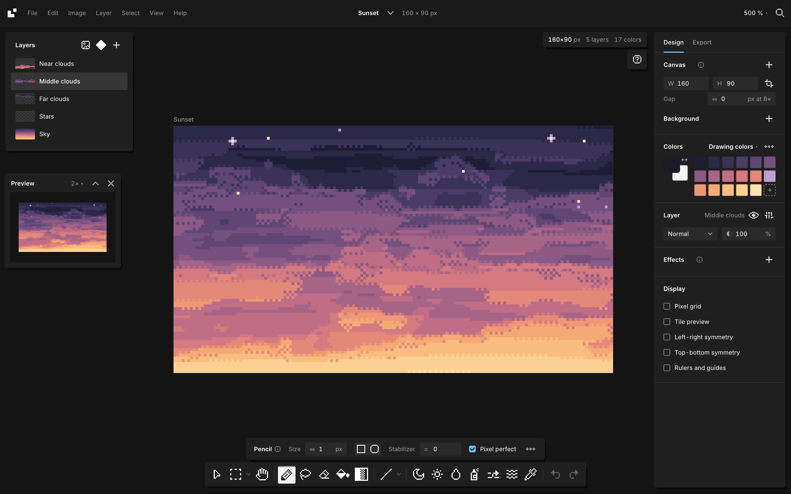

# Baipix

**A free online pixel art editor, with the interface of a modern design tool.** Open source, runs in the browser, no account needed, and exports clean SVG you can paste straight into Figma.

**[Open the editor](https://baipix.app/app/)** · [Website](https://baipix.app)



The sky above is [`docs/sunset.baipix`](docs/sunset.baipix): open it in Baipix (Open a .baipix file, or drop it on the canvas) to explore its layers.

## Pixel art that leaves as clean vector

Every color becomes a single SVG path, with neighboring pixels merged: light files, no seams between pixels, and one click to recolor in your design tool. **Copy as SVG** and paste straight into Figma or Illustrator, pixel gap included.

## Features

- **Drawing tools:** pencil with pixel-perfect mode and a stabilizer, eraser, lasso fill, spray, paint bucket (contiguous or global), a gradient tool (linear, radial, angular, diamond) in palette colors with dithering, eyedropper.
- **Selections:** rectangle, lasso and magic wand; Shift adds, Alt takes away, and every tool keeps to the selected pixels.
- **Shapes:** line, rectangle, rounded rectangle, ellipse, triangle, star and heart, outlined or filled.
- **Palette-aware tools:** shade and lighten pick the next darker or lighter palette color in OKLab; blur can snap its result back to the palette; liquify and jumble rework a drawing without adding colors.
- **Palettes:** Sweetie 16, PICO-8, Endesga 32, Game Boy… Paste any Lospec palette, build one from your drawing, or generate hue-shifted ramps.
- **Layers like a design tool:** groups four levels deep, blend modes, handles to resize and rotate, layers you copy from one file to another.
- **Components, like in Figma:** draw a sprite once, place instances of it anywhere, and they follow when you draw on it. Repeat one in a grid.
- **Layer effects:** outline, drop shadow and glow, drawn from the layer without changing its pixels.
- **Symmetry** around axes you can drag anywhere, **tile preview** for seamless textures, rulers and guides, a reference image to trace over.
- **Rendering for design work:** choose the exported pixel size and a gap between pixels (LED / dot-matrix look), previewed live on the canvas.
- **Export:** PNG, clean SVG (one path per color, merged runs), **copy as SVG to paste straight into Figma or Illustrator**, `.aseprite` files to keep working in Aseprite, `.baipix` project files, Lospec `.hex` palettes.
- **Local-first:** everything is saved in your browser (IndexedDB). Nothing is sent anywhere.
- English and French, light and dark themes.

## Getting started

```bash
npm install
npm run dev        # http://localhost:5173
```

| Script                 | What it does                                            |
| ---------------------- | ------------------------------------------------------- |
| `npm run dev`          | Development server with hot reload                      |
| `npm test`             | Unit tests (Vitest)                                     |
| `npm run typecheck`    | TypeScript checks                                       |
| `npm run lint`         | ESLint                                                  |
| `npm run build`        | Production build in `dist/`                             |
| `npm run build:single` | One self-contained `dist/index.html`, handy for sharing |

## Architecture

Baipix is split in two: a pure **engine** that knows nothing about the DOM, and a **React UI** on top of it.

```
src/
├── engine/        Pure TypeScript, fully unit-tested, no DOM
│   ├── editor.ts      State, commands, history, notifications (the only entry point for the UI)
│   ├── document.ts    Documents and layers
│   ├── tools/         One file per tool
│   ├── raster.ts      Lines, ellipses, flood fill, symmetry, pixel-perfect
│   ├── palette.ts     Presets, OKLab shading, ramps
│   ├── composite.ts   Layer blending
│   └── export/svg.ts  SVG export
├── storage/       .baipix file format, IndexedDB, StorageAdapter interface
├── io/            Browser I/O: downloads, PNG, clipboard, image import
├── i18n/          en.ts (source) and fr.ts
└── ui/            React components, panels, dialogs, canvas renderer
```

More details in [docs/ARCHITECTURE.md](docs/ARCHITECTURE.md).

## Privacy

Drawings are saved in your browser and never uploaded. baipix.app counts page views with [Cloudflare Web Analytics](https://www.cloudflare.com/web-analytics/), which uses no cookies and doesn't track you across sites. Nothing about your drawings or what you do in the editor is sent. A local copy (`npm run dev` or `npm run build:single`) sends nothing at all.

## Contributing

Contributions are welcome, from bug reports to new tools. Read [CONTRIBUTING.md](CONTRIBUTING.md) to get started: adding a tool or a language is a good first contribution. The [design system](https://baipix.app/app/design.html) shows the colors, components and icons to use, and the logo to download ([DESIGN.md](DESIGN.md) sums it up).

If you like Baipix, a ⭐ on [GitHub](https://github.com/baipix/baipix) helps other people find it.

## License

[MIT](LICENSE)

Icons from [Pixelarticons](https://pixelarticons.com) (MIT).
